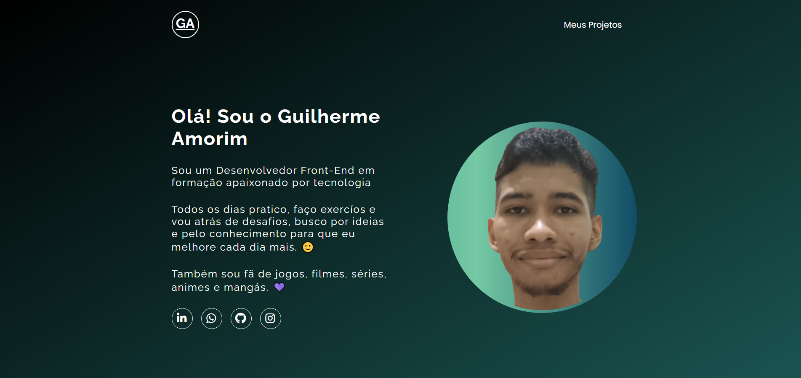

# Portfolio
- esse projeto é um exemplo de um portfólio de trabalho.

## Demonstração


* [Ver o site do projeto](https://gkptan.github.io/Portfolio/)

## Estrutura do projeto

```
Portfolio/
├── .gitattributes
├── LICENSE
├── README.md
├── index.html
└── src/
    ├── css/
    │   ├── estilos.css
    │   ├── reset.css
    │   └── responsivo.css
    ├── imagens/
    │   ├── foto-de-perfil (2).png
    │   ├── foto-de-perfil.png
    │   ├── projeto-gta.png
    │   └── projeto-one-piece.png
    └── js/
        └── index.js
```

## Tecnologias utilizadas

- HTML
- CSS
- JavaScript

## Aprendizados

- Aprimorando meus conhecimentos em HTML, CSS e JavaScript.
- HTML semântico, gradientes no css e DOM no JavaScript.

## Problemas e Bugs

- Se tiver encontrado algum bug ou problema, sinta-se à vontade para abrir uma issue com os detalhes ou corrigir o problema.

## Autor
- Guilherme Amorim
* [Linkedin](https://www.linkedin.com/in/guilherme-dos-santos-amorim-43b57a28b/)
* [Portfólio](https://gkptan.github.io/)